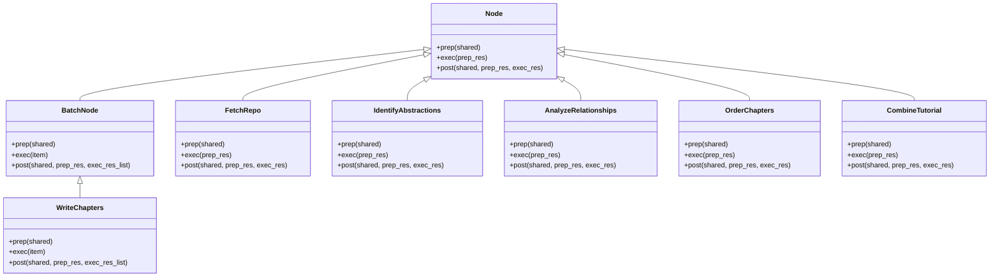

# Architecture Document for Codebase Knowledge Builder

## 1. Introduction

This document describes the high-level architecture of the Codebase Knowledge Builder application, which is designed to analyze codebases and generate comprehensive documentation in the form of tutorials or Software Architecture Documents (SAD).

## 2. System Overview

The Codebase Knowledge Builder is a command-line application that uses Large Language Models (LLMs) to analyze codebases and generate documentation. The application follows a pipeline architecture, where each stage of processing is handled by a specialized component.

## 3. Architectural Goals and Constraints

### 3.1 Goals

- **Modularity**: The system is designed with clear separation of concerns, allowing components to be developed and tested independently.
- **Extensibility**: The architecture supports the addition of new document types and processing steps without major changes to the existing codebase.
- **Reliability**: The system includes retry mechanisms and error handling to ensure robustness when dealing with external services.

### 3.2 Constraints

- **External Dependencies**: The system relies on external LLM services for analysis and content generation.
- **Processing Time**: The time required to process a codebase is dependent on the size and complexity of the codebase, as well as the responsiveness of the LLM service.

## 4. System Architecture

### 4.1 High-Level Architecture

The Codebase Knowledge Builder follows a pipeline architecture, where data flows through a series of processing stages:

```mermaid
graph LR
    Input[Input Parameters] --> FetchRepo
    FetchRepo[Fetch Repository] --> IdentifyAbstractions
    IdentifyAbstractions[Identify Abstractions] --> AnalyzeRelationships
    AnalyzeRelationships[Analyze Relationships] --> OrderChapters
    OrderChapters[Order Chapters] --> WriteChapters
    WriteChapters[Write Chapters] --> CombineTutorial
    CombineTutorial[Combine Tutorial] --> Output[Output Documentation]
```

### 4.2 Component Architecture

The application is built using the PocketFlow framework, which provides a way to define and execute workflows. Each component in the pipeline is implemented as a Node in the workflow:

## 5. Data Flow

The data flows through the system as follows:

1. **Input Parameters**: The user provides input parameters such as repository URL or local directory path, output directory, and document type.
2. **FetchRepo**: Fetches the repository or scans the local directory, collecting file contents.
3. **IdentifyAbstractions**: Analyzes the codebase to identify key abstractions (components, modules, concepts).
4. **AnalyzeRelationships**: Determines relationships between the identified abstractions.
5. **OrderChapters**: Determines the logical order for presenting the abstractions in the documentation.
6. **WriteChapters**: Generates the content for each chapter, using the LLM to create explanations, examples, and diagrams.
7. **CombineTutorial**: Combines the chapters into a final output, creating an index file and organizing the chapters in the specified output directory.
8. **Output Documentation**: The final documentation is saved to the specified output directory.

## 6. Technology Stack

- **Programming Language**: Python
- **Framework**: PocketFlow (for workflow definition and execution)
- **External Services**: Large Language Models (LLMs) for analysis and content generation
- **Output Format**: Markdown with Mermaid diagrams

## 7. Deployment View

The Codebase Knowledge Builder is a command-line application that can be run locally. It requires:

- Python 3.x
- Required Python packages (specified in requirements.txt)
- Access to an LLM service (configured through environment variables)

## 8. Quality Attributes

### 8.1 Performance

- The system is designed to handle codebases of varying sizes, with performance primarily limited by the responsiveness of the LLM service.
- Batch processing is used for chapter generation to improve throughput.

### 8.2 Reliability

- Retry mechanisms are implemented for LLM calls to handle temporary failures.
- Error handling is in place to ensure that failures in processing individual files do not cause the entire process to fail.

### 8.3 Extensibility

- The modular architecture allows for easy addition of new document types and processing steps.
- The use of a shared dictionary for passing data between components allows for flexible data exchange without tight coupling.

### 8.4 Usability

- The command-line interface provides clear options and help information.
- Progress information is displayed during processing to keep the user informed.
- The generated documentation is well-structured and easy to navigate.