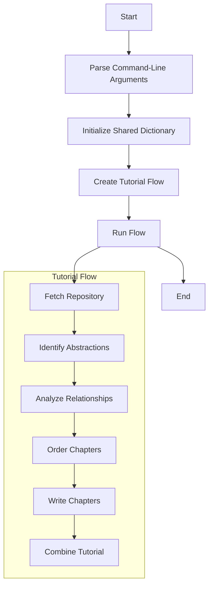

# Processing Flow Document for Codebase Knowledge Builder

## 1. Introduction

This document describes the detailed processing flow of the Codebase Knowledge Builder application, which analyzes codebases and generates comprehensive documentation in the form of tutorials or Software Architecture Documents (SAD).

## 2. Overall Flow

The Codebase Knowledge Builder follows a sequential processing flow, where each step builds upon the results of the previous steps. The flow is implemented using the PocketFlow framework, which provides a way to define and execute workflows.



## 3. Detailed Flow Description

### 3.1 Parse Command-Line Arguments

The application starts by parsing command-line arguments using the `argparse` library. The arguments include:

- Repository URL or local directory path (mutually exclusive, one is required)
- Project name (optional, derived from repo/directory if omitted)
- GitHub token (optional, for accessing private repositories)
- Output directory (default: ./output)
- Include/exclude file patterns (for filtering files)
- Maximum file size (for limiting processing to files under a specified size)
- Language for the generated documentation (default: english)
- Document type (tutorial or SAD, default: tutorial)

### 3.2 Initialize Shared Dictionary

A shared dictionary is initialized with the parsed arguments and empty containers for outputs. This dictionary is passed between the nodes in the workflow and is used to store intermediate results.

### 3.3 Create Tutorial Flow

The tutorial flow is created by instantiating the nodes and connecting them in sequence:

```python
fetch_repo = FetchRepo()
identify_abstractions = IdentifyAbstractions(max_retries=5, wait=20)
analyze_relationships = AnalyzeRelationships(max_retries=5, wait=20)
order_chapters = OrderChapters(max_retries=5, wait=20)
write_chapters = WriteChapters(max_retries=5, wait=20)
combine_tutorial = CombineTutorial()

fetch_repo >> identify_abstractions
identify_abstractions >> analyze_relationships
analyze_relationships >> order_chapters
order_chapters >> write_chapters
write_chapters >> combine_tutorial

tutorial_flow = Flow(start=fetch_repo)
```

### 3.4 Run Flow

The flow is executed by calling the `run` method on the flow instance, passing the shared dictionary:

```python
tutorial_flow.run(shared)
```

## 4. Node Processing Details

### 4.1 FetchRepo

**Purpose**: Fetch the repository or scan the local directory, collecting file contents.

**Processing Steps**:
1. Determine if the input is a GitHub repository URL or a local directory path.
2. If it's a GitHub repository:
   - Clone the repository to a temporary directory.
   - Crawl the repository using `crawl_github_files`.
3. If it's a local directory:
   - Crawl the directory using `crawl_local_files`.
4. Filter files based on include/exclude patterns and maximum file size.
5. Store the file contents in the shared dictionary.

**Inputs**:
- Repository URL or local directory path
- Include/exclude file patterns
- Maximum file size

**Outputs**:
- List of files with their contents

### 4.2 IdentifyAbstractions

**Purpose**: Analyze the codebase to identify key abstractions (components, modules, concepts).

**Processing Steps**:
1. Create a context string from the file contents.
2. Call the LLM to identify abstractions in the codebase.
3. Parse the LLM response to extract the abstractions.
4. Store the abstractions in the shared dictionary.

**Inputs**:
- List of files with their contents

**Outputs**:
- List of abstractions (name, description)

### 4.3 AnalyzeRelationships

**Purpose**: Determine relationships between the identified abstractions.

**Processing Steps**:
1. Create a context string from the file contents and abstractions.
2. Call the LLM to analyze relationships between abstractions.
3. Parse the LLM response to extract the relationships and summary.
4. Store the relationships and summary in the shared dictionary.

**Inputs**:
- List of files with their contents
- List of abstractions

**Outputs**:
- Relationships between abstractions
- Project summary

### 4.4 OrderChapters

**Purpose**: Determine the logical order for presenting the abstractions in the documentation.

**Processing Steps**:
1. Create a context string from the abstractions and relationships.
2. Call the LLM to determine the optimal order for presenting the abstractions.
3. Parse the LLM response to extract the chapter order.
4. Store the chapter order in the shared dictionary.

**Inputs**:
- List of abstractions
- Relationships between abstractions

**Outputs**:
- Chapter order (list of indices into the abstractions list)

### 4.5 WriteChapters

**Purpose**: Generate the content for each chapter, using the LLM to create explanations, examples, and diagrams.

**Processing Steps**:
1. For each abstraction in the chapter order:
   - Create a context string from the file contents, abstractions, and relationships.
   - Call the LLM to generate the chapter content.
   - Store the chapter content in the shared dictionary.

**Inputs**:
- List of abstractions
- Relationships between abstractions
- Chapter order
- List of files with their contents

**Outputs**:
- Chapter contents

### 4.6 CombineTutorial

**Purpose**: Combine the chapters into a final output, creating an index file and organizing the chapters in the specified output directory.

**Processing Steps**:
1. Create the output directory if it doesn't exist.
2. Generate a Mermaid diagram for the relationships between abstractions.
3. Create an index file with the project summary, Mermaid diagram, and links to the chapters.
4. Write each chapter to a separate file in the output directory.
5. Store the output directory path in the shared dictionary.

**Inputs**:
- Chapter contents
- Chapter order
- List of abstractions
- Relationships between abstractions
- Project summary

**Outputs**:
- Output directory path with generated documentation files

## 5. Data Flow Diagram

```mermaid
graph TD
    subgraph "Input"
        RepoURL[Repository URL]
        LocalDir[Local Directory]
        IncludePatterns[Include Patterns]
        ExcludePatterns[Exclude Patterns]
        MaxSize[Max File Size]
        Language[Language]
        DocType[Document Type]
    end

    subgraph "FetchRepo"
        FetchRepo[Fetch Repository]
    end

    subgraph "IdentifyAbstractions"
        IdentifyAbstractions[Identify Abstractions]
    end

    subgraph "AnalyzeRelationships"
        AnalyzeRelationships[Analyze Relationships]
    end

    subgraph "OrderChapters"
        OrderChapters[Order Chapters]
    end

    subgraph "WriteChapters"
        WriteChapters[Write Chapters]
    end

    subgraph "CombineTutorial"
        CombineTutorial[Combine Tutorial]
    end

    subgraph "Output"
        OutputDir[Output Directory]
        IndexFile[Index File]
        ChapterFiles[Chapter Files]
    end

    RepoURL --> FetchRepo
    LocalDir --> FetchRepo
    IncludePatterns --> FetchRepo
    ExcludePatterns --> FetchRepo
    MaxSize --> FetchRepo

    FetchRepo -- "Files" --> IdentifyAbstractions
    IdentifyAbstractions -- "Abstractions" --> AnalyzeRelationships
    AnalyzeRelationships -- "Relationships" --> OrderChapters
    OrderChapters -- "Chapter Order" --> WriteChapters
    Language --> WriteChapters
    DocType --> WriteChapters
    WriteChapters -- "Chapter Contents" --> CombineTutorial
    CombineTutorial --> OutputDir
    CombineTutorial --> IndexFile
    CombineTutorial --> ChapterFiles
```

## 6. Error Handling and Retry Mechanisms

The application implements retry mechanisms for LLM calls to handle temporary failures. The `IdentifyAbstractions`, `AnalyzeRelationships`, `OrderChapters`, and `WriteChapters` nodes all have a `max_retries` parameter set to 5 and a `wait` parameter set to 20 seconds. This means that if an LLM call fails, the node will retry the call up to 5 times, waiting 20 seconds between retries.

Error handling is also in place to ensure that failures in processing individual files do not cause the entire process to fail. If a file cannot be processed, it is skipped and the process continues with the remaining files.

## 7. Conclusion

The processing flow of the Codebase Knowledge Builder is designed to be sequential and modular, with each step building upon the results of the previous steps. The use of the PocketFlow framework allows for easy definition and execution of the workflow, and the shared dictionary provides a flexible way to pass data between the nodes.